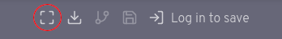
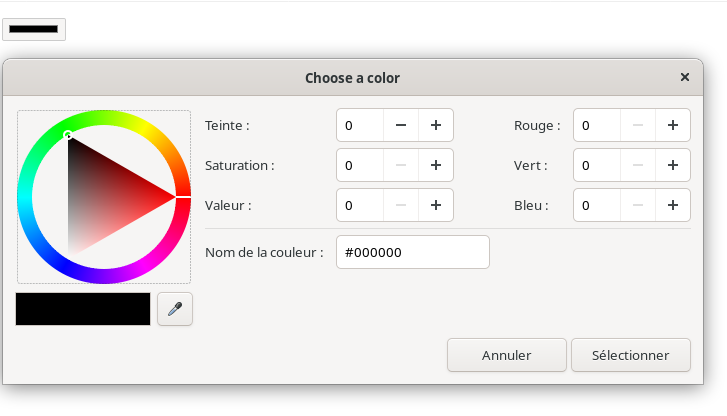

# Votre première application Svelte

Sans avoir à télécharger ou à installer quoi que ce soit, vous aller apprendre tout ce que vous devez savoir sur Svelte. Vous allez utiliser l'application <abbr title="Read, Evaluate, Print, Loop">REPL</abbr> sur le web. Un <abbr title="Read, Evaluate, Print, Loop">REPL</abbr> lit le code que vous saisissez, l'évalue, le met à jour et l'affiche. Il existe des <abbr title="Read, Evaluate, Print, Loop">REPL</abbr> pour de nombreux langages de programmation et de frameworks web. Le <abbr title="Read, Evaluate, Print, Loop">REPL</abbr> est une passerelle parfaite pour développer des petites applications. Pour de plus grandes applications, votre éditeur de texte ou IDE sera plus adapté à la situation.

Ce chapitre explique comment télécharger des applications <abbr title="Read, Evaluate, Print, Loop">REPL</abbr> pour un petit développement.  À la fin du chapitre, vous serez prêt à commencer à développer vos propres applications Svelte.

## le Repl de Svelte

[Svelte.dev](https://svelte.dev) fournit un <abbr title="Read, Evaluate, Print, Loop">REPL</abbr>. Il permet de définir des composants Svelte et de voir leur rendu. L'utilisation de ce <abbr title="Read, Evaluate, Print, Loop">REPL</abbr> est le moyen le plus facile d'expérimenter Svelte.

Pour commencer, allez sur le site Web principal de [Svelte.dev](https://svelte.dev). Puis cliquez sur le lien <abbr title="Read, Evaluate, Print, Loop">REPL</abbr>. Vous devriez constater qu'il y a d'ores et déjà une petite application qui se nome "Hello World".

### L'utilisation du <abbr title="Read, Evaluate, Print, Loop">REPL</abbr> de svelte

Le seul fichier fourni dans le <abbr title="Read, Evaluate, Print, Loop">REPL</abbr> est App.svelte. Ce fichier peut en importer d'autres. Ils sont définis dans des onglets supplémentaires au sein du <abbr title="Read, Evaluate, Print, Loop">REPL</abbr>.

Pour ajouter d'autres fichiers .svelte ou .js, cliquez sur le bouton plus (+) à droite des onglets. Donnez au fichier, un nom. Par défaut, les fichiers nouvellement créés ont une extension *.svelte. Pour signifier que vous utiliserez un ficheir *.js, renommer complètement l'onglet.

> REMARQUE : En général, lorsque vous constatez l'erreur "Failed to construct 'URL' : Invalid base URL", cela signifie que le nom de l'onglet (donc le nom du fichier) ne comporte pas d'extension. De ce fait, il vous sera impossible d'importer ce dernier.

Pour supprimer un fichier :
- cliquez sur son onglet
- cliquez sur le "X" qui apparaît à droite du nom de fichier.

Le <abbr title="Read, Evaluate, Print, Loop">REPL</abbr> contient trois onglets à droite :
- result : L'onglet result affiche la sortie rendue de App.svelte. Lorsque cet onglet est sélectionné, le coin inférieur droit du <abbr title="Read, Evaluate, Print, Loop">REPL</abbr> affiche le résultat de l'application.
- JS output : Cet onglet affiche le code compilé en Javascript
- CSS output : Cet onglet le CSS minifié et généré par l'application.

La barre supérieure du <abbr title="Read, Evaluate, Print, Loop">REPL</abbr> contient des liens vers de nombreuses ressources Svelte (tutoriel, la documentation de l'API, des exemples, le blog Svelte, la FAQ Svelte, la page d'accueil de Sapper, etc.).


Pour masquer la barre de navigation, vous pouvez cliquer sur le bouton "fullscreen" (plein écran). Ce bouton se changera en forme de croix



Lorsque vous appuyez une nouvelle fois sur ce même bouton, la barre de navigation principale réapparait.

### Votre première application Svelte

Créons une application simple et commençons à découvrir certaines fonctionnalités de Svelte.

Ajoutez le code HTML avant l'élément h1 :
```
<label for="name">Name</label>
<input id="name" value={name}>
```

> REMARQUE : L'élément HTML input est ce que l'on appelle un mono-élément ou élément auto fermant. Lorsque des mono-éléments vides sont utilisés dans des composants Svelte ils n'ont pas besoin d'être terminés par /> . Cependant, si Prettier est utilisé pour formater le code, il modifiera les mono éléments pour qu'ils soient terminés de cette façon.. C'est pourquoi certains exemples de code dans ce tuto montrent des mono éléments terminés

Maintenant nous devons saisir un nom, mais cela ne change pas le message d'accueil. lorsque l'utilisateur saisit le nom; nous devons ajouter un événement afin que la valeur de la variable "name" soit mise à jour.
Pour ajouter un événement et ainsi gérer la mise à jour de la variable "name", modifiez l'élément input comme ceci :

```
<input id="name" on:input={event => name = event.target.value} value={name} />
```

Cela fonctionne ! Mais ce n'est pas toujours la bonne solution. Nous pouvons faire mieux en utilisant la directive Svelte bind. Plus tard, nous parlerons des nombreuses utilisations de la directive bind. L'une d'entre elles consiste à lier la valeur d'un élément (input) d'un formulaire à une variable.
à une variable.

faites ce changement :
```
<input id="name" bind:value={name} />
```

Nous pouvons même raccourcir le code si le nom de l'attribut est le même nom que la variable à écouter :
```
<input id="name" bind:value />
```

c'est bien beau tout ça, mais ça manque de fantaisie, n'est ce pas ? Après le code HTML, ajoutez ceci :

```
<style>
    h1 {
        color: orangered;
    }
</style>
```

Maintenant, le titre doit être en rouge orangé. Il serait intéressant que l'utilisateur puissent changer la couleur de ce titre. Nous allons ajouter un champs de type color. L'avantage de cet élément html, c'est qu'il permet de sélectionner une couleur. Un clic sur cet élément ouvre une
Sélecteur de couleurs.



Voici le code complet qui permet de changer la couleur du titre, la couleur de fond d'un carré.

```
<script>
    let color = '#FF5349';
    let name = 'tout le monde';
</script>

<label for="name">Votre nom</label>
<input id="name" bind:value={name}>

<label for="color">Couleur </label>
<input id="color" type="color" bind:value={color}>

<div style="background-color: {color}" class="swatch" />
<h1 style="color: {color}">Salut {name}!</h1>

<style>
    .swatch {
        display: inline-block;
        height: 20px;
        width: 20px;
    }
</style>
```

Ajoutons une fonctionnalité afin de permettre à l'utilisateur de changer le texte en majuscule:

```
let upper = false;
$: greeting = `Salut ${name}!`;
$: casedGreeting = upper ? greeting.toUpperCase() : greeting;
```

Que signifie $: ? Il s'agit d'une instruction réactive. Les instructions réactives sont ré-exécutées chaque fois que la valeur d'une variable à laquelle elles font référence change. Les déclarations réactives qui attribuent une valeur à une variable sont également appelées déclarations réactives. Nous en parlerons plus en détail. Cela fera objet d'un chapitre à part entière.
Dans le code précédent, nous calculons une nouvelle valeur pour 'greeting' chaque fois que la valeur de name change. Puis nous calculons une nouvelle valeur pour casedGreeting à chaque fois que la valeur de 'upper' ou 'greeting' change. Pratique n'est ce pas ? ajoutons un champ de type checkbox afin de modifier la valeur de 'upper'

```
<label><input type="checkbox" bind:checked={upper}> Uppercase </label>
```
N'oublions pas de changer le titre :

```
<h1 style="color: {color}">{casedGreeting}</h1>
```

Nous avons fini avec cette mini application. Vous pouvez la télécharger en cliquant sur le bouton "download"


Lorsque vous cliquez sur celui-ci, vous devriez récupérez un zip. Si vous dézippez dans un dossier et que vous vouliez tester en local, vous devez avoir installé nodeJS et npm sur votre ordinateur.

Pour tester en local :
- ouvrir un terminal
- aller dans le dossier dézippé
- saisir la commande "npm install"
- saisir la commande "npm run dev"
- le terminal va vous indiquer l'url à aller sur votre navigateur.

Nous avons fait un bref tour d'horizon de Svelte. Il y a tellement de bonnes choses encore à voir. 
