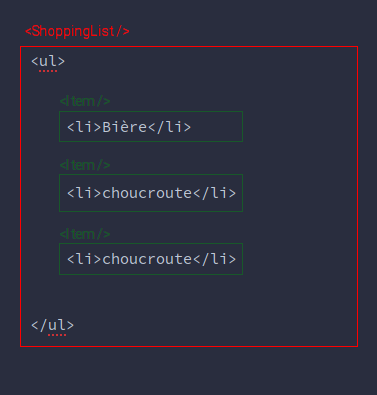

# Comment créer un composant ?

Dans ce cours, nous allons approfondir la création des composants en créant des fichiers .svelte. Ces fichiers permettent d'implémenter en JavaScript la logique et l'état du HTML. Le css quant à lui, stylise les éléments au sein du composant.

Les composants sont composés de parties étroitement liées à l'interface utilisateur. Ils scindent une interface utilisateur potentiellement réutilisables. Certains composants représentent des pages entières, tandis que d'autres sont utilisés dans des pages. Par exemple, une page qui affiche une liste de courses peut être implémentée par un composant du nom "ShoppingList". Ce composant peut rendre chaque élément dans un autre composant plus petit. ce petit composant pourrait se nommer "item" par exemple. Les composants svelte ont une syntaxe similaire au HTML.



La logique d'un composant est définie par un ensemble de fonctions qui spécifient son comportement. Le traitement des événements inclue cette logique.

Le css peut être global et affecte tous les composants. Le plus souvent, il est "scopé", de sorte qu'il n'affecte que le composant lui même. Le CSS et les langages préprocesseurs tels que Sass peuvent être utilisés pour obtenir des fonctionnalités supplémentaires. Les instructions réactives ($:) permettent de réexécuter le code à chaque fois que la valeur d'une variable déclarée change. Souvent, ces instructions modifient l'état. Ce qui entraîne la mise à jour de certaines parties du composant.

À la fin de ce chapitre, vous serez en mesure de créer des composants qui peuvent être utilisés dans n'importe quelle application Svelte.

## Le contenu d'un fichier svelte

Les composants Svelte sont définis par le contenu d'un fichier, et non par un conteneur JavaScript dans le fichier, comme une classe, une fonction ou un objet littéral. La création d'un composant Svelte est aussi simple que de créer un fichier portant l'extension .svelte et respectant certaines règles de base. Ces fichiers doivent se trouver dans le répertoire src ou dans un sous-dossier de celui-ci.

Les fichiers .svelte peuvent contenir :

- au maximum un élément script context="module"
- un élément de type script
- un élément de type style
- un nombre quelconque d'éléments HTML qui peuvent apparaître dans l'élément body.

Chacun d'entre eux est facultatif et ces éléments peuvent apparaître
dans n'importe quel ordre.

La structure classique d'un fichier svelte est ainsi :

```html
<script>
// code javascript du composant.
</script>

<script context="module">
// code javascript mutalisé du composant.
</script>

<!-- le html du composant  -->

<style>
 /*
 le css spécifique à ce composant
 */
</style>

```

## Le composant au microscope

Vous avez remarqué au cours précédent que la syntaxe pour rendre le composant est très proche du HTML, n'est ce pas ? Un composant svelte utilise quasiment la même syntaxe.

```html
<NomDuComposant unePropriete="une valeur" />
```
ou
```
<NomDuComposant unePropriete="une valeur"></NomDuComposant>
```

Les props (propriétés) d'un composant permettent de transmettre :

- des chaines de caractères
- des objets
- des nombres
- des composants
- etc.

Ainsi, le composant récupère via ces props toutes les données dont il a besoin pour fonctionner.

Voici un exemple plus concret du passage de valeur à un composant svelte :

```html
<User
    firstname="Jean"
    lastname="Martin"
    email="jmartin@gmail.com"
    hobbies={ [ "le cinéma", "écouter de la musique", "la photo", "l'informatique" ] }
    description={{ "silhouette": "mince", "date anniversaire": "01/01/1970", "poids": 80 }}
    age={calculateBirth(user)}
    beOfAge={true}   
/>
```

> REMARQUE: lorsque une valeur n'est pas définie ou qu'elle est null, elle ne sera pas ajouter dans le DOM. Par exemple, au sein du composant il y a ce tag . Si la variable description est nulle ou indéfinie, l'élément img n'aura pas d'attribut alt.


- Aller dans le REPL
- ajouter un onglet.
- Nommer cette onglet : "User.svelte"
- Saisissez le code ci-dessous :

```html
<script>
	export let firstname;
	export let lastname;
	export let email;
	export let hobbies;
	export let description;
	export let age;
	export let beOfAge;

	$: fullName = `${firstname} ${lastname}`;
	$: resultBeOfAge = beOfAge? "il est majeur" : "il n'est pas majeur";
</script>

<div>
{fullName} a {age} ans et {resultBeOfAge}.
</div>
<p>
	Ces loisirs sont :
</p>
<ul>
	<li>{@html hobbies.join('</li><li>')}</li>
</ul>
```

- Aller dans l'onglet App.svelte
- Efface tout son contenu
- Saisissez le code ci-dessous :

```html
<script>
	import User from './User.svelte';
    let description = {
        "silhouette": "mince",
        "date anniversaire": 'July 20, 1970 00:20:18',
        "poids": 80
    }
    let beOfAge = calculateBirth() > 18? true : false;
	let calculateBirth = () =>{
        let now = new Date().getFullYear()
        let userBirthDay = new Date(description["date anniversaire"]).getFullYear();
		return  now - userBirthDay
	}
    let hobbies = [ "le cinéma", "écouter de la musique", "la photo", "l'informatique" ]
</script>

<User
    firstname="Jean"
    lastname="Martin"
    email="jmartin@gmail.com"
    hobbies={hobbies}
    description={description}
    age={calculateBirth()}
    beOfAge={beOfAge}
/>
```

> REMAQUE: Vous avez peut être remarqué un @html à l'intérieur des accolades ? En effet, si vous l'omettez, le html au sein de l'expression JavaScript entre les accolades ne sera pas interprété.

Parfois certains composants récupèrent tellement de props que votre fichier va devenir illisible. Vous pouvez raccourcir aisément cette écriture.

Si le nom de la props et le même nom de la variable à passer dans le composant, vous pouvez écrire comme ceci :

de ceci :
```
<User firstname={firstname} />
```
à cela :
```
<User {firstname} />
```
Nous pouvons aller encore plus loin pour raccourcir l'écriture. En reprenant l'exemple précédent et en utilisant le spread operator !

```html
<script>
	import User from './User.svelte';
	let description = {
        "silhouette": "mince",
        "date anniversaire": 'July 20, 1971 00:20:18',
        "poids": 80
    }
    let calculateBirth = () =>{
        let now = new Date().getFullYear()
        let userBirthDay = new Date(description["date anniversaire"]).getFullYear();
		return  now - userBirthDay
	}
    let beOfAge = calculateBirth() > 18? true : false;

    let data = {
        description, // raccourci es6 !
        age : calculateBirth(),
        beOfAge, // raccourci es6 !
        firstname : "Jean",
        lastname : "Martin",
        email : "jmartin@gmail.com",
        hobbies : [ "le cinéma", "écouter de la musique", "la photo", "l'informatique" ]        
    }

</script>

<User {...data} />
```

### le nom du composant et son appel

Vous pouvez le nommez comme vous voulez. Par convention, il est préférable d'utiliser le Camel case avec une majuscule sur la première lettre. Aussi, éviter les fantaisies de nommer le composant d'une manière différente de son import. Vous risquez de vous perdre en route ! En d'autres termes, le nom du composant doit refléter le nom du fichier.

```javascript
import UnComposant from "./quelque-chose.svelte"
```

### le css et la class conditionnelle

Admettons que suivant le contexte vous ayez besoin de changer la couleur du message. Rien de plus facile. Il vous suffit de binder la class :

```html
<script>
    let status = 200;
    let message = "un message"
</script>
<label>
    <span>changer le statut</span>
    <input type="text" bind:value={status}>
</label>

<div class:error={status >= 400 }>{message}</div>

<style>
    .error {
        color: red;
        font-weight: bold;
    }
</style>
```  

Il existe d'autres manières pour arriver au même résultat :

```html
<div class={status >= 400 ? 'error' : ''}>{message}</div>
```

ou encore ceci avec une syntaxe plus condensée dans le code html:

```html
<script>
    let status = 200;
    $: error = status > 400
    //etc.
</script>
<!-- etc. -->
<div class:error>{message}</div>
<!-- etc. -->
```

### Appliquer une logique dans un composant

Vous avez 3 manières d'appliquer la logique dans un composant :
- les fonctions ou expression JS dans l'élément script
- des expressions entres les accolades dans un élément html
- l'utilisation de blocs de contrôles spécifiques à svelte (Ce point fera l'objet d'un cours à part entière)

Dans l'exemple précédent, la logique est appliqué à l'instruction réactive.


### global.css et les styles au sein d'un composant

Dans une application svelte, vous avez 2 sortes de css. Le fichiers global.css qui se trouve dans le dossier public. Vous avez aussi les styles déclarés dans le composant. Lorsque vous remarquez qu'une règle css est commune, il est préférable de l'ajouter dans le global.css. **Le css appliqué au sein d'un composant n'affectera pas les autres composants**.

Vous pouvez utiliser le sass. Cependant, il va falloir configurer rollup.config.js ou webpack.config.js. Une fois configurer, vous n'avez plus qu'à déclarer votre élément style comme ceci :

```html
<style lang="scss">
/* etc. */
</style>
```

### Les instructions réactives

Comment déclarer une instruction réactive ? Dans Svelte, il vous suffit de saisir "$:" suivant de la variable à calculer. Si vous devez faire un calcul en fonction d'une variable d'état, il est préférable d'utiliser une instruction de type réactive. Pour illustrer mon propos, je vous invite à saisir et à tester le code ci-dessous.


```html
<script>
	let rayon = 5;
	let height = 20;
	$: diameter = rayon * 2;
	$: area = Math.PI * diameter;
	$: volume = area * height;

	$: posX1 = 250 - (diameter * Math.PI)
	$: posX2 = 250 + (diameter * Math.PI)

</script>
<div class="global">
    <div class="data">
        <div>
            <div class="input text">
            	<label>
            		<strong>rayon</strong><input type="range" min="5" max="35" bind:value={rayon} />
            	</label>
            </div>
            <div class="input text">
            	<label>
            		<strong>height</strong><input type="range" min="20" max="300" bind:value={height} />
            	</label>
            </div>
        </div>
        <div class="result">
            <dl>
                <dt>rayon : </dt>
                <dd>{rayon}</dd>
                <dt>diametre : </dt>
                <dd>{diameter}</dd>
                <dt>aire : </dt>
                <dd>{area.toFixed(2)}</dd>
                <dt>volume : </dt>
                <dd>{volume.toFixed(2)}</dd>
            </dl>
        </div>
    </div>
    <svg height="500" width="500" viewBox="0 0 500 500">
      <ellipse cx="250" cy={height + 80} rx={area} ry="10" />
      <rect x={posX1} y="80" width={area * 2} height={height} />
      <line x1={posX1} y1="80" x2={posX1} y2={height + 80} />
      <line x1={posX2} y1="80" x2={posX2} y2={height + 80} />
      <ellipse cx="250" cy="80" rx={area} ry="10" />
    </svg>
</div>

<style>
    .global{
        width: 75%;
        margin: 0 auto;
        display: grid;
        grid-template-columns: 250px 1fr;
        grid-column-gap: 25px;
    }

    .global .input{
        text-align: center;
        padding: 25px;
        border: 1px solid #ddd;
        border-radius: 12px;
        margin-bottom: 15px;
    }

    .global .input strong{
        display: block;
    }

    dt{
        float: left;
        margin-right: 15px;
        font-weight: bold;
    }

    ellipse{
        fill:white;
        stroke:orangered;
        stroke-width:2
    }

    line{
        stroke:orangered;
        stroke-width:2
    }

    rect{
        fill:white;
    }
</style>
```

### Les modules de contexte

Parfois, vous souhaitez mutualiser une fonction ou autres au travers de différents composants. Rien du plus simple, il vous suffit de déclarer un élément script avec un attribut "context" et sa valeur sera "module". Je vous invite à lire le code qui suit :

fichier UnCompsant.svelte
```html
<script context="module">
    let pow = a => a * a;
</script>
```

fichier UnAutreCompposant.svelte
```html
<script>
    import onMount from 'svelte';
    import {pow} from './UnCompsant.svelte'

    onMount = ()=>{
        let resultPow = pow(3)
        console.log(resultPow)
    }
</script>
```

### créer un composant

Nous allons finir ce cours par créer un composant et ce dernier est quelque chose de classique. Si vous avez lu le cour, vous ne devriez pas être trop perdu. Nous verrons dans d'autres cours, les notions de passage de variables via les event ou les structures de contrôle.


fichier Select.svelte
```html
<script>
    export let options;

    import {createEventDispatcher} from 'svelte';

    let dispatch = createEventDispatcher();

</script>

<select on:change={event => dispatch('select', event.target.value)}>
    {#each options as option}
        <option value={option.label.toLowerCase()}>{option.label}</option>
    {/each}
</select>
```

fichier App.svelte
```html
<script>
    import Select from './Select.svelte';

    let selected;
    let options = [
        {label: 'Vert'},
        {label: 'Jaune'},
        {label: 'Rouge'},
        {label: 'Orange'},
        {label: 'Violet'},
        {label: 'Rose'},
    ];    
</script>

<Select {options} on:select={e => select = e.detail} />
{#if selected}
<p>vous avez sélectionné la couleur : {selected}</p>
{/if}
```
